# Architectural Rationale

> [!NOTE]
> This document answers the "why" questions about MAF Local's design.  
> For implementation details, see [`architecture/CURRENT.md`](../architecture/CURRENT.md).  
> For historical decisions, see [`architecture/DECISIONS.md`](../architecture/DECISIONS.md).

---

## Why Hierarchical Agents?

### Context

Modern coding assistants (GitHub Copilot, Cursor) are powerful but limited:
- Single agent handles all tasks (autocomplete, refactoring, testing, docs)
- No memory of complex, multi-step workflows
- Cannot pause and resume after human intervention
- Prone to "cognitive overload" when asked to context-switch rapidly

### The Problem

**Cognitive Overload:** When a single agent must:
1. Understand user intent
2. Plan implementation
3. Write code
4. Write tests
5. Update documentation
6. Handle edge cases

...it generates **unfocused, boilerplate-heavy responses** because it's optimizing for breadth, not depth.

### Our Solution: Hierarchical Specialization

Inspired by organizational structures (CEO → Managers → ICs):

```mermaid
flowchart TD
    User["👤 User"]
    L["Tier 1: Liaison<br/>(Intent Filter)"]
    PL["Tier 2: Project Lead<br/>(Orchestrator)"]
    DL1["Tier 3: Development Lead"]
    DL2["Tier 3: QA Lead"]
    DL3["Tier 3: Docs Lead"]
    E1["Tier 4: Coder"]
    E2["Tier 4: Tester"]
    E3["Tier 4: Writer"]
    
    User --> L
    L --> PL
    PL --> DL1
    PL --> DL2
    PL --> DL3
    DL1 --> E1
    DL2 --> E2
    DL3 --> E3
```



**Each tier has ONE job:**
- **Tier 1 (Liaison):** Filter and clarify user intent
- **Tier 2 (Project Lead):** Translate intent into a structured plan (MAF Workflow)
- **Tier 3 (Domain Leads):** Manage specialized executors (Dev, QA, Docs)
- **Tier 4 (Executors):** Perform atomic tasks (write function, run test, update doc)

### Benefits

✅ **No Cognitive Overload:** Each agent has minimal context  
✅ **Auditable:** Every decision logged by Project Lead (PostgreSQL)  
✅ **Resilient:** Checkpoints enable pause & resume after human input  
✅ **Scalable:** Add new Domain Leads without refactoring existing agents  
✅ **Quality:** Executors focus on depth, not breadth

### Trade-offs

⚠️ **Complexity:** More agents = more orchestration overhead  
⚠️ **Latency:** Multi-hop communication (L → PL → DL → E) adds delay  
⚠️ **Learning Curve:** Developers must understand MAF SDK workflow patterns

### Alternative Approaches Considered

| Approach | Why Rejected |
|:---|:---|
| **Single Agent** | Cognitive overload, no specialization |
| **Flat Multi-Agent** (No hierarchy) | No clear escalation path for ambiguity |
| **Custom Workflow Engine** | Reinventing the wheel (MAF SDK already solves this) |

**Outcome:** Hierarchical specialization chosen for **auditability + resilience + scalability**.

---

## Why Microsoft Agent Framework (MAF SDK)?

### Context

Building multi-agent systems requires:
1. Workflow orchestration (agent A → agent B → agent C)
2. Durable state (resume after crashes)
3. Message passing (type-safe communication)
4. Checkpointing (pause & resume)

### The Problem

Custom solutions are fragile:
- Reinventing workflow engines leads to bugs
- Ad-hoc checkpointing is error-prone
- No enterprise support (governance, telemetry, identity)

### Our Solution: MAF SDK

Microsoft Agent Framework provides:

**✅ WorkflowBuilder:** Graph-based orchestration  
**✅ CheckpointStorage:** Durable, resumable workflows  
**✅ AgentThread:** Temporal state management (conversation history)  
**✅ Context Providers:** Pluggable memory backends  
**✅ Type Safety:** `AIFunction` auto-generates tool schemas from Python type hints

### Example: Why Checkpointing Matters

**Scenario:** Agent is refactoring a large file. Halfway through, human says "Wait, use a different pattern."

**Without Checkpoints:**
- Agent restarts from scratch  
- Loses progress  
- Wastes time and LLM tokens

**With MAF SDK Checkpoints:**
```python
# Workflow pauses
checkpoint = await checkpoint_storage.save_checkpoint(workflow.state)

# Human provides new guidance
# ...

# Workflow resumes from checkpoint
workflow = await checkpoint_storage.load_checkpoint(checkpoint_id)
await workflow.resume()
```

### Trade-offs

⚠️ **Learning Curve:** Must understand MAF SDK patterns  
⚠️ **Framework Lock-in:** Migrating away from MAF SDK would be costly  
⚠️ **Compliance Requirements:** Must adhere to MAF SDK standards (async, type hints, Context Providers)

**Outcome:** MAF SDK chosen for **durability + enterprise readiness + avoiding reinventing the wheel**.

---

## Why FOSS-First (Ollama + PostgreSQL + ChromaDB)?

### Context

LLM-powered systems can:
1. Use cloud APIs (OpenAI, Anthropic, Google)
2. Use local models (Ollama, llama.cpp)
3. Use hybrid (local primary, cloud fallback)

### The Problem

**Cloud-Only Issues:**
- **Privacy:** Code and data sent to third parties
- **Cost:** $0.01-$0.10 per request adds up fast
- **Latency:** API calls = network round-trip
- **Offline:** No internet = no functionality

**Local-Only Issues:**
- **Capability:** Local models < GPT-4 class
- **Hardware:** Requires GPU (not everyone has one)

### Our Solution: Hybrid FOSS-First

```yaml
Primary: Ollama (Llama 3.1 8B Instruct)
Fallback: Gemini 2.0 Flash (via LiteLLM Proxy)
```

**Philosophy:**
- **Default to local** (privacy + cost)
- **Fallback to cloud** when local models insufficient (complex reasoning, very long context)

### Why PostgreSQL + ChromaDB?

| Need | Technology | Reason |
|:---|:---|:---|
| **Structured Data** | PostgreSQL | ACID guarantees for audit logs, governance |
| **Vector Search** | ChromaDB | Optimized for semantic search (RAG) |

**Both are FOSS**, lightweight, and integrate with MAF SDK.

### Trade-offs

⚠️ **Hardware Requirement:** NVIDIA GPU (8GB+ VRAM) for local models  
⚠️ **Infrastructure Complexity:** Docker services for Ollama, PostgreSQL, ChromaDB  
⚠️ **Capability Gap:** Local models weaker than GPT-4

**Outcome:** FOSS-first chosen for **privacy + cost + control** with cloud safety net.

---

## Why Read-Only Source Mount (Phase 10)?

### Context

Original vision: DevStudio modifies its own source code to self-improve.

### The Problem: Confused Deputy

**Scenario:** Agent has write access to `/home/robb/projects/maf-local/src/`.

**Risk:**
1. Agent accidentally deletes critical file (`agent_factory.py`)
2. DevStudio crashes
3. Cannot recover without manual intervention

**Worse:** Malicious prompt injection could intentionally corrupt system.

### Our Solution: Principle of Least Authority (PoLA)

**Phase 10 Pivot:**
- DevStudio source code mounted **read-only** in Docker
- Projects live in `/workspaces/{project_id}/` (read-write)
- Agents **CANNOT** modify system code

**What This Enables:**
- **Security:** Eliminates self-modification risk
- **Scalability:** DevStudio becomes a **service** managing external projects
- **Commercial Viability:** Clients can trust DevStudio won't corrupt itself

### Trade-offs

⚠️ **No Self-Upgrade:** DevStudio can't automatically update itself (requires manual rebuild)  
⚠️ **Complexity:** Project registry, session management, scoped databases

**Outcome:** PoLA chosen for **security + trust + enterprise readiness**.

---

## Why Dual UI (Streamlit + Next.js)?

### Context

Two UI needs:
1. **Chat interface** for Liaison Agent (simple, text-based)
2. **Agent graph visualization** (complex, interactive)

### The Problem

Single framework can't optimize for both:
- Streamlit: Great for rapid prototyping, poor for complex visualizations
- Next.js: Powerful for interactivity, overkill for simple chat

### Our Solution: Right Tool for Each Job

| UI | Framework | Port | Purpose |
|:---|:---|:---|:---|
| **Chat** | Streamlit | 8501 | Liaison home base (rapid iteration) |
| **Graph** | Next.js + React Flow | 3000 | Real-time agent visualization |

**Both share:** Same FastAPI backend (`/api/agent_api.py`)

### Trade-offs

⚠️ **Two Codebases:** Maintain JavaScript + Python UIs  
⚠️ **State Sync:** WebSocket coordination between UIs

**Outcome:** Dual UI chosen for **optimal UX** at cost of increased maintenance.

---

## Why Context Providers Instead of Direct ChromaDB Access?

### Context

Agents need persistent memory (RAG). Two approaches:
1. **Direct Access:** Instantiate `chromadb.HttpClient` in agent code
2. **Context Provider:** Use MAF SDK's abstraction layer

### The Problem with Direct Access

**Current Violation** ([`context_retrieval_agent.py`](file:///home/robb/projects/maf-local/src/agents/context_retrieval_agent.py)):
```python
self.chroma_client = chromadb.HttpClient(host="localhost", port=8000)
```

**Issues:**
- ❌ Not portable (hardcoded to ChromaDB)
- ❌ Bypasses MAF SDK governance/telemetry
- ❌ Cannot swap backends without refactoring agent code

### Our Solution: MAF SDK Context Providers

```python
# Agent code
async def store_knowledge(self, content: str):
    await self.memory.store(content)  # Generic interface

# Dependency injection
memory_provider = ChromaDBContextProvider(...)
agent = ContextRetrievalAgent(memory_provider=memory_provider)
```

**Benefits:**
- ✅ **Pluggable:** Swap ChromaDB → Azure Blob without changing agent code
- ✅ **Governed:** All memory operations logged via MAF SDK
- ✅ **Portable:** Works across MAF deployments (local, cloud, enterprise)

### Trade-offs

⚠️ **Abstraction Overhead:** One more layer between agent and database  
⚠️ **Implementation Effort:** Must create `ChromaDBContextProvider` class

**Outcome:** Context Providers chosen for **portability + governance + MAF SDK compliance**.

---

## Why Async/Await Everywhere?

### Context

Python supports both synchronous and asynchronous I/O. Why mandate `async`?

### The Problem with Blocking I/O

**Scenario:** Agent calls LLM (network I/O). Synchronous code blocks the entire event loop:

```python
# ❌ BLOCKS for 2 seconds while waiting for LLM response
response = llm_client.chat("Hello")  # Synchronous
```

**Impact:** Other agents can't run until this completes.

### Our Solution: Async I/O

```python
# ✅ Event loop can handle other agents while waiting
response = await llm_client.chat("Hello")  # Non-blocking
```

**MAF SDK Requirement:** All I/O operations MUST be async for workflow orchestration.

### Trade-offs

⚠️ **Complexity:** `async`/`await` syntax takes time to learn  
⚠️ **Library Compatibility:** Some libraries don't support async (need wrappers)

**Outcome:** Async I/O chosen for **high throughput + MAF SDK compliance**.

---

## Template: Adding New Rationale

When a new "why" question arises, add it here:

```markdown
## Why [Decision or Pattern]?

### Context
[Background: what prompted this question?]

### The Problem
[What issue were we trying to solve?]

### Our Solution
[What did we choose and why?]

### Trade-offs
⚠️ [Costs or limitations]

**Outcome:** [Chosen solution] for [primary benefits].
```

**Keep rationales concise.** Link to ADRs or architecture docs for implementation details.
