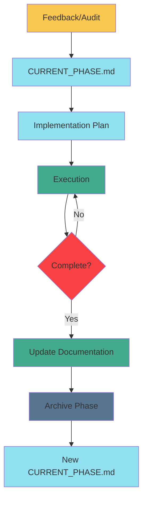

# Phase Management Workflow

**Purpose:** Define the feedback → planning → implementation → archive cycle  
**For:** All agents working on this project  
**Last Updated:** 2025-11-21

---

## Overview

This project uses a structured phase management workflow to track work from initial feedback/audits through completion and archival. This document defines the canonical process.



---

## Workflow Stages

### 1. Feedback / Audit (Input)

**Purpose:** Identify areas for improvement or compliance issues.

**Artifacts:**
- `docs/feedback/*.md` - Audit reports, post-mortems, retrospectives

**Example:**
- [`maf_sdk_compliance_audit.md`](../../../docs/feedback/maf_sdk_compliance_audit.md) identified architectural violations

**Output:** List of findings and recommendations

---

### 2. Current Phase Tracking

**File:** [`docs/planning/CURRENT.md`](../planning/CURRENT.md)

**Purpose:** Track the active phase with clear status and success criteria.

**Contents:**
- Phase ID and name
- Status (🚧 IN PROGRESS, ✅ COMPLETED, 📋 PLANNED)
- Implementation plan reference
- Task breakdown with checkboxes
- Success criteria
- Dependencies and blockers
- Progress tracking (completed/in-progress/pending)

**When to Create:** Start of each new major work phase

**When to Update:** As tasks complete or status changes

---

### 3. Implementation Plan

**Files:** `docs/planning/implementations/*.md`

**Purpose:** Convert feedback/audits into actionable technical plan.

**Format:**
```markdown
# [Feature/Phase] Implementation Plan

## Goal
Clear statement of what this phase achieves

## User Review Required
Breaking changes or design decisions

## Proposed Changes
### Component 1
#### [NEW|MODIFY|DELETE] file.py
- Detailed changes
- Code examples

## Verification Plan
### Automated Tests
- Test commands
### Manual Verification
- Manual testing steps

## Migration Path
- Step-by-step execution
```

**Example:**
- Implementation plans in `docs/planning/implementations/`

**Output:** Concrete file-level changes and test plan

---

### 4. Execution

**Purpose:** Implement the plan.

**Tracking:**
- Update `CURRENT.md` checkboxes as tasks complete
- Mark items in artifact `task.md` (ephemeral, agent-specific)

**Artifacts Created:**
- Code changes
- Test files
- Documentation updates

---

### 5. Completion & Documentation

**When Phase Complete:**

1. **Update Architecture Docs:**
   - [`docs/architecture/CURRENT.md`](../architecture/CURRENT.md)
   - [`docs/.ai/MANIFEST.yaml`](../.ai/MANIFEST.yaml)

2. **Resolve Related Issues:**
   - Mark audit findings as resolved
   - Update compliance documents

3. **Update Planning:**
   - Mark phase complete in tracking docs

---

### 6. Archival

**File:** [`docs/planning/ARCHIVE.md`](../planning/ARCHIVE.md)

**Purpose:** Compress completed phase into a summary for future reference.

**Process:**
1. Summarize phase goals, deliverables, outcomes
2. Link to detailed documentation (if preservation needed)
3. Append to ARCHIVE.md
4. Delete or move detailed implementation plan (optional)

**Archive Format:**
```markdown
## **Phase X.Y: [Name]** ✅ COMPLETED

**Duration:** [Time] ([Dates])  
**Goal:** [One sentence]

### Key Deliverables
- Component 1: Implementation
- Component 2: Implementation

### Outcome
Final state, metrics, lessons learned

**Details:** [Link to detailed docs if preserved]
```

---

### 7. New Phase

**Create New Content in CURRENT.md:**
- Clear the previous phase
- Define next phase goals
- Reference new implementation plan
- Start cycle again

---

## File Hierarchy

```
docs/
├── planning/
│   ├── CURRENT.md                    ← Active phase tracking
│   ├── implementations/              ← Detailed implementation plans
│   ├── ARCHIVE.md                    ← Compressed history
│   └── WORKFLOW.md                   ← This file
├── feedback/
│   └── *_audit.md                    ← Audit reports (inputs)
├── architecture/
│   └── CURRENT.md                    ← Updated after each phase
└── .ai/
    ├── MANIFEST.yaml                 ← Feature tracking
    └── agents.md                     ← Agent specifications
```

---

## Agent Instructions

### When Starting New Work

1. **Check CURRENT_PHASE.md** - Is there an active phase?
2. **Read Implementation Plan** - Understand detailed requirements
3. **Update task.md** - Create ephemeral task breakdown
4. **Execute** - Implement according to plan
5. **Update Progress** - Mark checkboxes in CURRENT_PHASE.md

### When Receiving Feedback/Audit

1. **Review Findings** - Understand issues
2. **Create Implementation Plan** - Convert to actionable steps
3. **Create/Update CURRENT_PHASE.md** - Track new phase
4. **Request User Approval** - Get sign-off before execution
5. **Execute** - Follow plan

### When Completing Phase

1. **Verify Success Criteria** - All items met?
2. **Update Documentation** - CURRENT_STATE.md, roadmap.md
3. **Archive Phase** - Add to Phase_Planner_ARCHIVE.md
4. **Clear CURRENT_PHASE.md** - Prepare for next phase

---

## Benefits

**For Agents:**
- Clear current objectives
- Structured work breakdown
- Defined success criteria

**For Users:**
- Visibility into active work
- Single source of truth for status
- Historical archive for context

**For Project:**
- Consistent workflow
- Auditable progress
- Reusable patterns

---

## Example: MAF SDK Compliance (Current)

1. **Feedback:** [MAF SDK Compliance Audit](../../../docs/feedback/maf_sdk_compliance_audit.md) identified violation
2. **Current Phase:** [CURRENT_PHASE.md](../../../docs/planning/CURRENT_PHASE.md) tracks Phase 10.1
3. **Implementation:** [maf_sdk_compliance_implementation.md](../../../docs/planning/maf_sdk_compliance_implementation.md) details refactoring
4. **Execution:** In progress (creating ChromaDBContextProvider)
5. **Archive:** Will summarize in Phase_Planner_ARCHIVE.md when complete
6. **Next:** Create new CURRENT_PHASE.md for Phase 10 proper

---

## Quick Reference

| Question | Answer |
|:---|:---|
| What are we working on? | Check [`CURRENT_PHASE.md`](../../../docs/planning/CURRENT_PHASE.md) |
| What's the detailed plan? | Linked implementation plan in CURRENT_PHASE.md |
| What have we done? | [`Phase_Planner_ARCHIVE.md`](../../../docs/planning/Phase_Planner_ARCHIVE.md) |
| What's next? | [`roadmap.md`](../../../docs/planning/roadmap.md) |
| What needs fixing? | [`docs/feedback/`](../../../docs/feedback/) |

---

## Meta

This workflow itself may evolve. Updates to this process should:
1. Update this document (phase_management_workflow.md)
2. Notify in project changelog
3. Update [AGENT_INSTRUCTIONS.md](../.ai/AGENT_INSTRUCTIONS.md) if agent behavior changes
