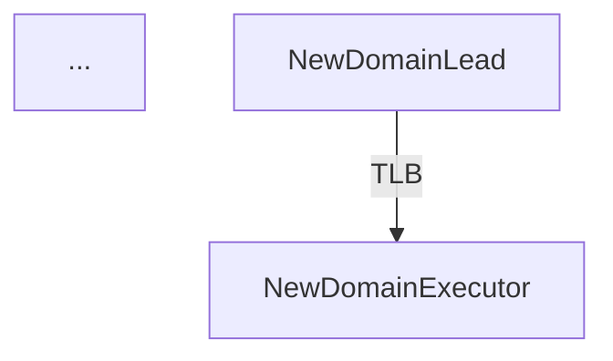

# Adding a New Domain Guide

This guide walks through the steps required to add a new domain to the MAF‑local system.

## 1. Create a Domain Lead

Create a new class in `src/agents/domain_leads/` that inherits from `BaseDomainLead`.
```python
from src.agents.domain_leads.base_domain_lead import BaseDomainLead

class NewDomainLead(BaseDomainLead):
    def __init__(self, **kwargs):
        super().__init__(domain="NewDomain", **kwargs)

    # Implement any domain‑specific logic here
```

* Register the new lead in `src/agents/domain_leads/__init__.py`.
* Add any required executors for the domain (e.g., `NewDomainExecutor`).

## 2. Update the API Reference

* Add the new lead to `docs/05_API_REFERENCE/modules/agents.md` under **Domain Leads**.
* Document any new executors in the **Executors** section.
* Provide a usage example similar to the `CoderExecutor` example.

## 3. Adjust the Architecture Diagram

* Extend the Mermaid diagram in `docs/01_ARCHITECTURE/CURRENT.md` to include the new domain lead and its executor.


## 4. Verify Integration

* Write unit tests for the new lead (`tests/unit/test_new_domain_lead.py`).
* Add integration tests to ensure the OLB/TLB workflows route tasks correctly.
* Run the full test suite and compliance checks.

## 5. Commit & Handoff

* Stage the changes (`git add .`).
* Update `PROJECT_MANIFEST.md` with a new **CodeCommitReport** entry.
* Create a `SESSION_TOKEN.md` for the DOCS handoff.

---

**Tip:** Follow the existing style guidelines for headings, code blocks, and tables to keep documentation consistent.
